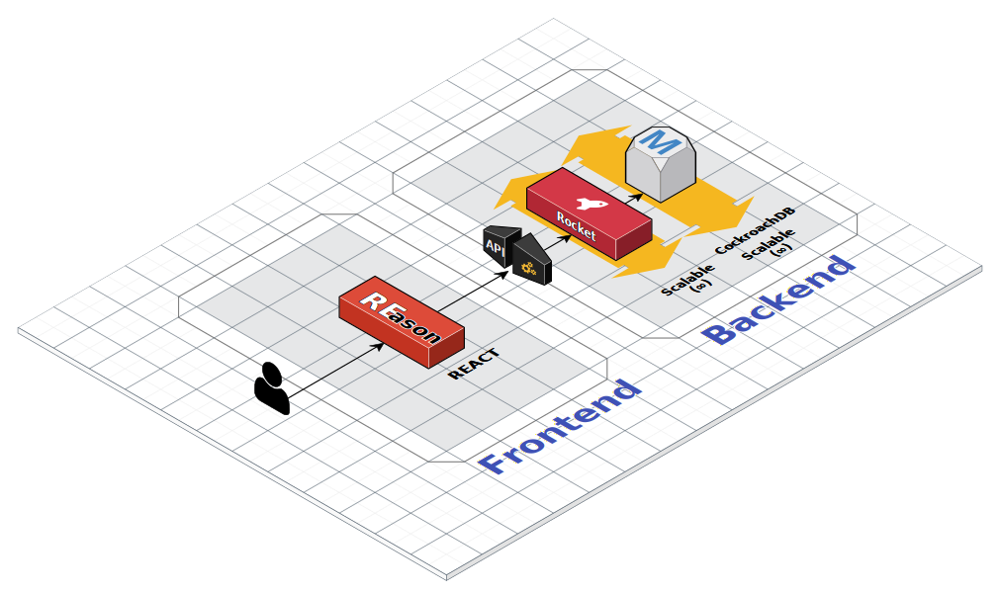
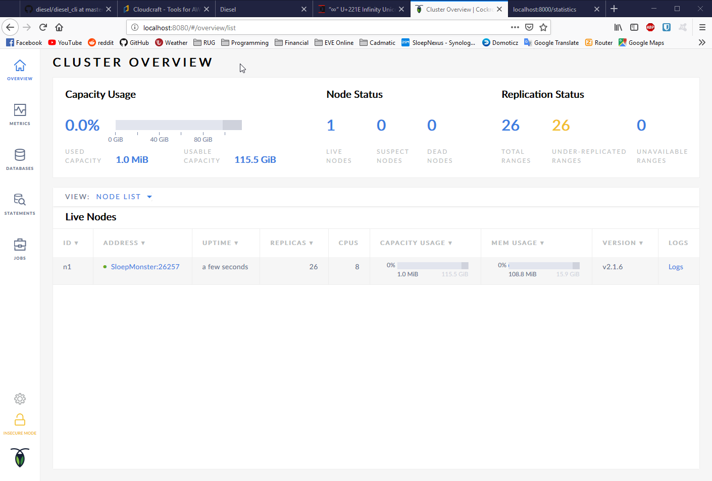
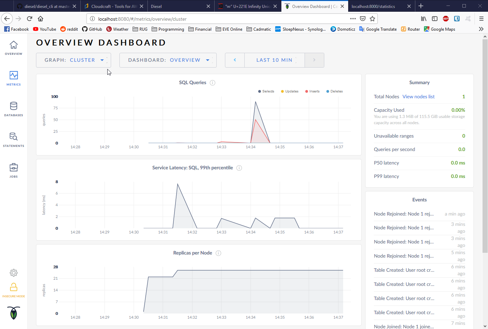

# Architecture Design
This document serves to define the Architecture of the Corgi Flight Statistics Web Application.
# Version 0.0.1
## Milestone Checklist 
- [x] Provide a high-level architecture of the Web app
    - [x] including the technologies tobe used and their justification.
- [x] Identify one or more value-added features to be offered through the Web app(optional).
    - [x] Graphical representation
    - [x] User reported delays?
- [x] The use of a database for persistence is optional but recommended.
    - [x] We design with the intention of keeping the levels of effort to implement a database being only that of implementing the database itself.
- [x] Include diagrams
- [x] Add json/csv output for EVERYthing in docs
- [x] Add csv representation in code
- [x] Add HAL for HATEOAS solution
    - [ ] FUlly available

# High Level Architecture

## Client Server Architecture
Clients fetch data from the server. More servers can be spun up to handle scaling in future, predicated on having abstract data access layer. Initially for development and for shortly after deployment, all data can be stored within memory. This allows for keeping costs down during initial development since there are no extra server costs. We expect a low amount of requests per second following release, with a slow ramp up. If the web app begins to show signs of exponential growth, the abtracted data access will be quickly switched over to a standard Postgres or SQL database. The time to implement this would by only that of setting up the database itself.

The frontend will fetch data from the server, and manipulate it client side to render charts and graphs, as well as store smaller chunks of data in the cache for faster loading each time the user opens the site. Since some of the data rarely ever changes, and takes a relatively small amount of space, we can store the codes and name of the airlines and airports directly within the cache. Only when the user needs up-to-date statistics will they need to fetch information from the server again.

## Thick Client
View, rendering of data in charts, sorting, etc, occur (mostly) in the client. Can optimize and refresh data that is out of date. Could be extended to smartly cache to reduce fetching for graph generation.

# Valuable Features
Our front end will deliver the basic requirements, plus the ability to render statistics in graphical charts, as well as submit new reports for delays. These reports will contain information that will allow us to add the delay, but ensure that it is not entered more than once if multiple people report the same delay. As this would cause inflation that does not match the actual delay statistics.

# Backend Technology Selection
We are using Rust for our backend. This language strives for the trifecta of concurrency, speed, and saftey. 

## Rocket (Rust)
---
Type saftey, speed, familiarity in team, General Saftey, and Security.

We implement our web app backend in Rocket for Rust. Rocket delivers some key features that we wanted:
#### Speed
Rocket is *extremely* fast. Compared to Node.js (via Restify), Rust could handle approx. *10x* the number of requests per second. This means for us, that we can keep our customers happy with short waiting times, and keep costs minimal with fewer servers required to handle the traffic volume.

#### Type Safe
From request to response, the Rocket server will ensure at compilation that everything will work without hidden errors or unexpected results.

#### API Request Gaurd
We can ensure the security of our endpoints with gaurds that protect the handler from running unless certain conditions are met by the incoming request metadata. 

#### Data Type
We are able to serve different data types with less effort by wrapping them.

#### It isn't JavaScript
We don't like Javascript. We were familiar with Rust, so we chose the better of the two.

## rustic_hal
---
This is a library that we include to manage our HATEOAS reponse body. It manages the links and references of our objects and will automatically output a formatted json for a request.

## Serde
---
[Serde](https://serde.rs) is a framework for serializing and deserializing Rust data structures efficiently and generically.

The Serde ecosystem consists of data structures that know how to serialize and deserialize themselves along with data formats that know how to serialize and deserialize other things. Serde provides the layer by which these two groups interact with each other, allowing any supported data structure to be serialized and deserialized using any supported data format.

## Diesel
---
[Diesel](https://diesel.rs) is the most productive way to interact with databases in Rust because of its safe and composable abstractions over queries.

Diesel eliminates the possibility of runtime errors, incorrect database interactions, at compile time. It is a high level query builder with a focus on performance. The extensible design is designed to be abstacted over. Which enables us to write reusable code and think in terms of the problem domain and not SQL.

## CockroachDB
---
[CockroachDB](https://www.cockroachlabs.com/product/cockroachdb/) is a fully featured database building on top of postgres. It is fast, secure, and highly scalable with automatic redistribution, load balancing, and error handling. It offers analytics, and a very user-friendly UI, displayed below:

# Frontend Technology Selection

## ReasonML (OCAML)
---
Solves JS problem (AKA, don't use it). We do not like JS.
As with out backend, we wanted to find a frontend framework that is not JavaScript. So we set out and found ReasonML. This is an OCAML framework.

## React (ReasonReact)
---
Functional Reactive Programming. Messages, state, model, reactions.

## MaterialUI
---
### Recharts

### RemoteData

# Install Instructions
The process is simple, but please refer to our install instructions in: [./install_info.md](./install_info.md) for up to date, step by step instructions.
